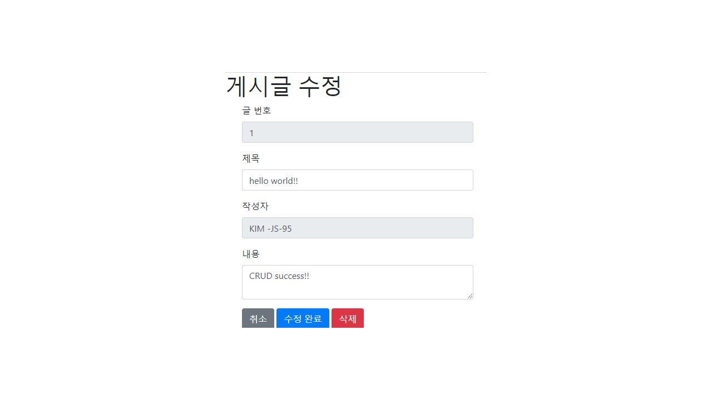
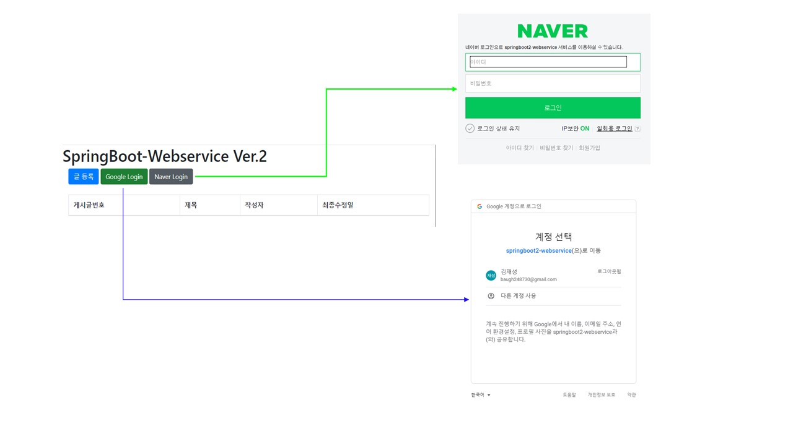

### SPRINGBOOT2 - CRUD WEBSERVICE
 1. Google Login && Naver Login
 2. CRUD
 3. AWS(AMAZON Linux Instance) 적용 && RDBS(Maria DB)

### Version
 1. java -version : 15.0.1
 2. gradle -version : 4.10.2
 
### ScreenShot
[1] 상단: 게시판 로그인 서비스
    하단: crud 게시판

[2] 로그인 서비스(Google && Naver 즉시 연동 가능)

[3] 예시) Google 로그인 페이지

